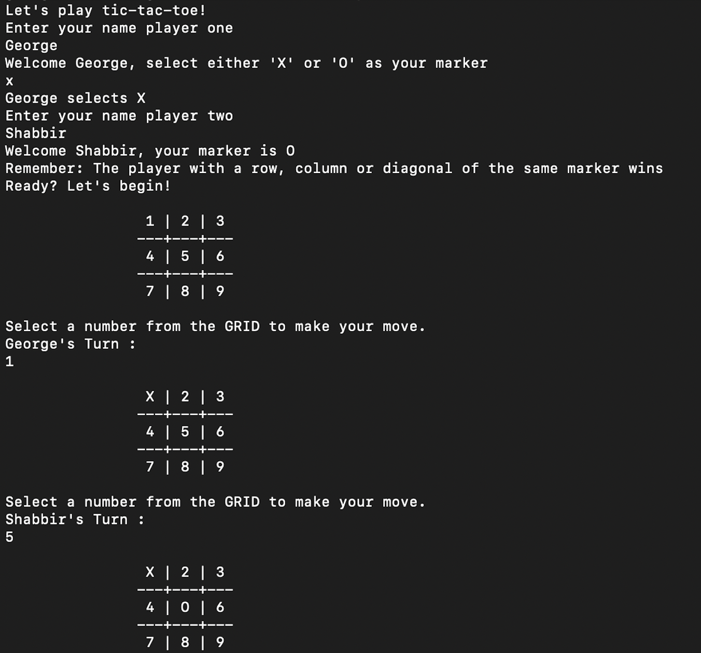
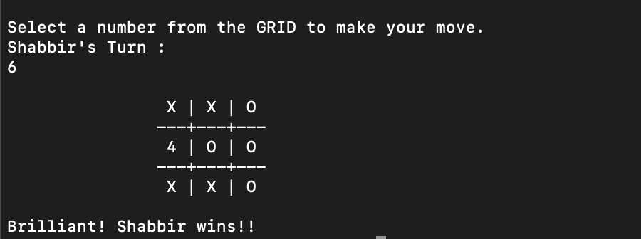

# TicTacToe

# Project Name: RUBY IMPLEMENTATION OF THE CLASSIC TIC TAC TOE Game

```
    #######             #######               #######
        #                   #                     #
        #    ##   ####      #    ####   ####      #     ####   ###
        #     #  #   #      #       #  #   #      #    ##  ## #   #
        #     #  #          #    ####  #          #    #    # #####
        #     #  ##         #    #  #  ##         #    ##  ## #
       ###   ###  ####     ###   #####  ####     ###    ####   ####
```

Start of the game:



A winner:



## Skills Revived & Learned:

- Versioning & best coding practices, Git Flow.
- RUBY Datastructures, features etc.
- Linter - install & fix errors
- Collaborative learning, being patient, helping each other succeed.
- Self Monitoring & reliable project deliverables on due time, being focused, accountable.
- Ability to work independently and ask for help after due self research when needed.

### Learning Goals:

- Version Control, Git Flow
- Application of RUBY Syntax & Programming elements.
- User I/P & O/P via terminal / command line validation and control

## Installation

Add this line to your application's Gemfile:

```ruby
gem 'tic_tac_toe'
```

And then execute:

    $ bundle install

Or install it yourself as:

    $ gem install tic_tac_toe

## Usage

- main.rb - entry point file is a command line executable
- Enter Player 1 'Name' & Preferred Marker from `['X' or 'O']`
- Enter Player 2 'Name' & PreferAutomatically assigned Marker from `['X' or 'O']`
- View the Displyed Game Board Layout & wait for prompt to a preferred position
- Enter the number visible on the GRID to place your MARKER.
- Once a number is selected hit Enter & X / O will appear on the BOARD
- Players Take turn entering the preferred location and try to make a WIN
- Winning Combinations Include: Player should place 3 same markers in a horizontal, vertical, diagnol positions as displayed below

## Development

After checking out the repo, run `bin/setup` to install dependencies. You can also run `bin/console` for an interactive prompt that will allow you to experiment.

To install this gem onto your local machine, run `bundle exec rake install`. To release a new version, update the version number in `version.rb`, and then run `bundle exec rake release`, which will create a git tag for the version, push git commits and the created tag, and push the `.gem` file to [rubygems.org](https://rubygems.org).

## Authors

:silhouette: **Shabbir**

- GitHub: [@smy5152](https://github.com/smy5152)
- Twitter: [@smy5152](https://twitter.com/smy5152)
- LinkedIn: [Shabbir Yamani](https://www.linkedin.com/in/shabbirmyamani/)

👤 **Ubong George**

- GitHub: [@george-swift](https://github.com/george-swift)
- Twitter: [@\_\_pragmaticdev](https://twitter.com/__pragmaticdev)

## Show your support

Give a :star:️ if you like this project!

## Contributing

Bug reports and pull requests are welcome on GitHub at https://github.com/smy5152/tic-tact-toe. This project is intended to be a safe, welcoming space for collaboration, and contributors are expected to adhere to the [code of conduct](https://github.com/smy5152/tic-tact-toe/blob/development/CODE_OF_CONDUCT.md).

## License

The gem is available as open source under the terms of the [MIT License](https://opensource.org/licenses/MIT).

## Code of Conduct

Everyone interacting in the TicTacToe project's codebases, issue trackers, chat rooms and mailing lists is expected to follow the [code of conduct](https://github.com/smy5152/tic-tact-toe/blob/development/CODE_OF_CONDUCT.md).
